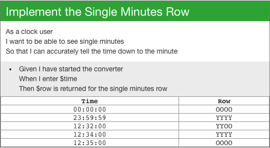
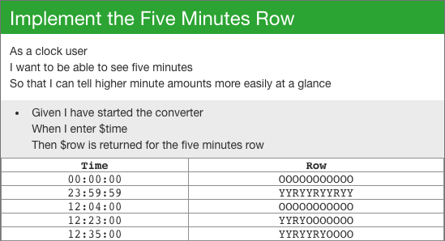
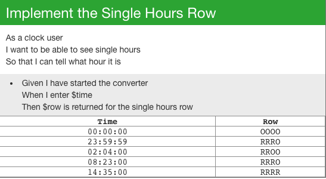
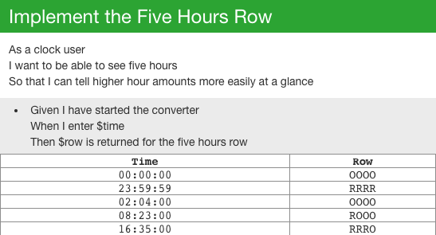
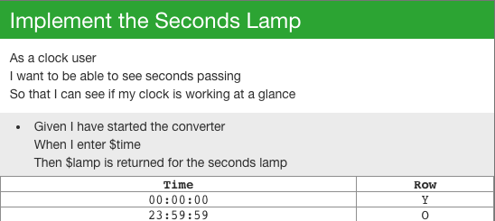
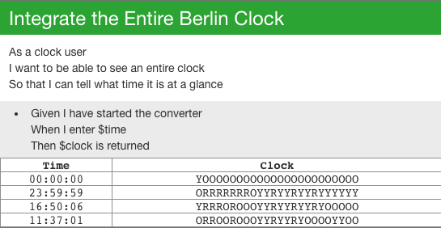
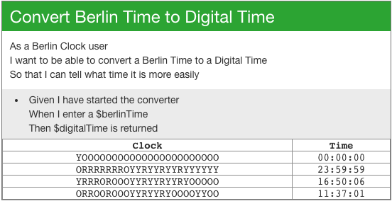

# Berlin Clock Kata

The Berlin Clock (Mengenlehreclock or Berlin Uhr) is a clock that tells the time using a series of illuminated coloured
blocks.
The top lamp blinks to show seconds- it is illuminated on even seconds and off on odd seconds.

The next two rows represent hours. The upper row represents 5 hour blocks and is made up of 4 red lamps. The lower row
represents 1 hour blocks and is also made up of 4 red lamps.

The final two rows represent the minutes. The upper row represents 5 minute blocks, and is made up of 11 lamps- every
third lamp is red, the rest are yellow. The bottom row represents 1 minute blocks, and is made up of 4 yellow lamps.

## Features
### Feature 1 - Converting Digital Time to Berlin Time
So what we want first is a way to get a textual representation of a Berlin Clock time based on a digital time.
This is so we can use this converter everywhere, all we have to do is hook up a frontend. We're going to be going over
the clock row by row to make things clearer and ensure we get everything right first time.

#### List of tasks:

1. Implement the Single Minutes Row:

2. Implement the Five Minutes Row:

3. Implement the Single Hours Row:

4. Implement the Five Hours Row:

5. Implement the Seconds Lamp:

6. Integrate the Entire Berlin Clock:

### Feature 2 - Converting Berlin Time to Digital Time
The change to using Berlin Time has gone so well that we've decided to introduce it everywhere, from the clocks on the microwaves to the company-approved wristwatches. Unfortunately, people are having trouble quickly deciphering the current time which is having a detrimental effect on productivity. As such, we need to create a converter that takes a Berlin Time and returns a Digital Time.

#### List of tasks:

1. Convert Berlin Time to Digital Time:

