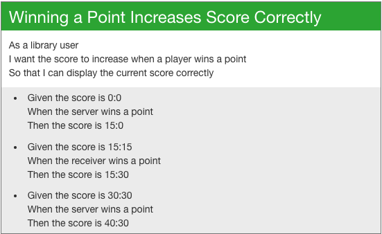

# Tennis Kata

Tennis is a ball and racquet game that is scored in an interesting way. Instead of scoring the game using consecutive
integers to denote number of points won by the players, it uses the scoring 0, 15, 30, 40, and A.

There are also special rules on how to score a game in tennis. A player must score at least four points in total and
two more than their opponent to win. When the points are four, and the scores are equal, then the score is 'deuce'
(40:40). When the points are four or more, and a player has one point more than their opponent, then the score is
'advantage' (A:40).

## Features
We want a program that can be used to score a game in real time, so we can use it for all of the tennis related
endeavours we plan to undertake in the future. To begin with, we're going to need a way to update the score when a
player wins a point, see what the current score is after each service, and see if their is a winner based on the
current score and the rules above.

### Task 1

### Task 2

### Task 3

